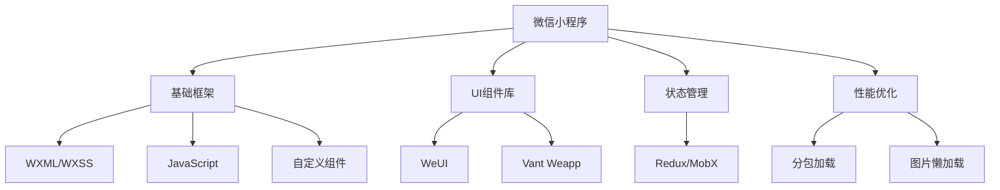
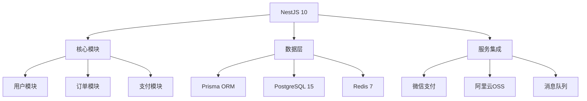
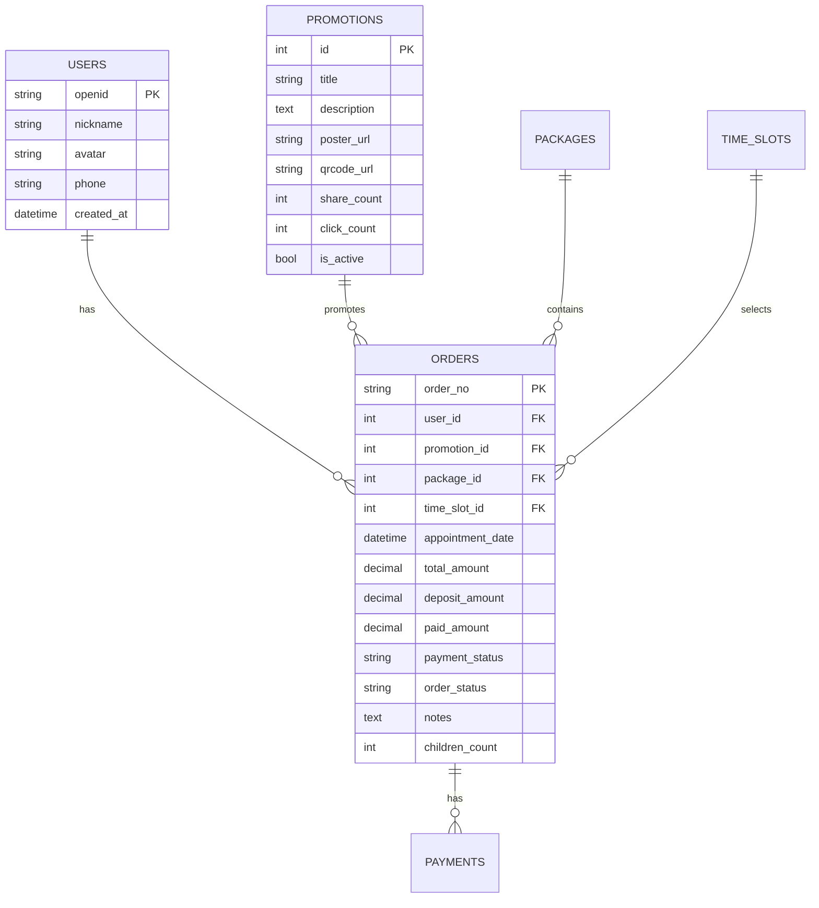
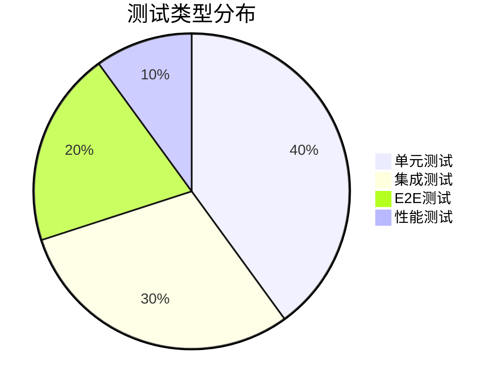
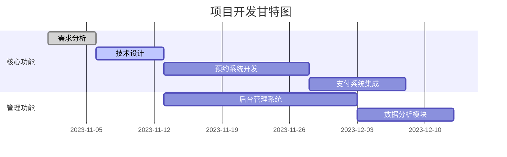

# 乖宝宝儿童影楼微信小程序开发方案文档

## 1. 项目概述

### 1.1 项目背景
乖宝宝儿童影楼希望借助微信小程序，实现线上推广、预约、支付和客户管理，最终提升业务效率和客户体验。

### 1.2 项目目标
- **完整线上预约系统**：支持套餐选择、时间预定、支付处理等功能  
- **灵活支付方案**：支持定金、尾款以及全额支付  
- **数据驱动决策支持**：通过数据分析辅助运营决策  
- **可扩展技术架构**：满足未来业务扩展需求

---

## 2. 技术架构

### 2.1 前端架构


### 2.2 后端架构

liyong@dely:~/gbb$ node -v
v18.19.1
liyong@dely:~/gbb$ npm -v
10.2.4

postgresql 已经是最新版 (17+281.pgdg120+1)。
postgresql-contrib 已经是最新版 (15+248)。
---

## 3. 详细功能设计

### 3.1 预约系统流程
```python
def appointment_flow():
    # 1. 客户选择服务套餐
    package = select_package()
    
    # 2. 选择可用预约时间
    time_slot = select_available_time(package.duration)
    
    # 3. 填写客户信息
    customer_info = get_customer_info()
    
    # 4. 支付处理：定金或全额支付
    if choose_deposit():
        payment = process_deposit()
    else:
        payment = process_full_payment()
    
    # 5. 确认预约及后续处理
    confirm_appointment(package, time_slot, customer_info, payment)
```

### 3.2 支付状态机设计
```typescript
class PaymentStateMachine {
  private states = {
    CREATED: { to: ['PAID', 'FAILED'] },
    PAID: { to: ['REFUNDED'] },
    FAILED: { to: ['CREATED'] },
    REFUNDED: { to: [] }
  };

  transition(currentState: string, newState: string) {
    if (this.states[currentState].to.includes(newState)) {
      return true;
    }
    throw new Error('Invalid state transition');
  }
}
```

---

## 4. 数据库设计

### 4.1 数据库ER图


---

## 5. API规范

### 5.1 创建预约

#### 请求示例
```http
POST /api/v1/appointments
Content-Type: application/json
Authorization: Bearer {token}

{
  "package_id": 1,
  "time_slot_id": 123,
  "customer_info": {
    "name": "张三",
    "phone": "13800138000",
    "children_count": 1
  },
  "payment_type": "deposit|full"
}
```

#### 响应示例
```json
{
  "code": 200,
  "data": {
    "order_no": "ORD202311011234",
    "payment_info": {
      "amount": 500.00,
      "pay_url": "https://pay.weixin.qq.com/..."
    }
  }
}
```

### 5.2 查找功能API规范

#### 5.2.1 用户查找接口

**手机号码查找用户**
```http
GET /api/v1/search/users/by-phone?phone=13800138000
Authorization: Bearer {admin_token}
```

**用户昵称查找用户**
```http
GET /api/v1/search/users/by-nickname?nickname=张三&fuzzy=true
Authorization: Bearer {admin_token}
```

#### 5.2.2 订单查找接口

**手机号码查找订单**
```http
GET /api/v1/search/orders/by-phone?phone=13800138000
Authorization: Bearer {admin_token}
```

**时间区间查找订单**
```http
GET /api/v1/search/orders/by-date-range?start_date=2024-01-01&end_date=2024-01-31
Authorization: Bearer {admin_token}
```

**支付状态查找订单**
```http
GET /api/v1/search/orders/by-payment-status?status=PAID&page=1&limit=20
Authorization: Bearer {admin_token}
```

**套系名称查找订单**
```http
GET /api/v1/search/orders/by-package-name?package_name=儿童写真套系A&fuzzy=true
Authorization: Bearer {admin_token}
```

#### 5.2.3 套系查找接口

**价格区间查找套系**
```http
GET /api/v1/search/packages/by-price-range?min_price=500&max_price=1500&sort=price_asc
Authorization: Bearer {token}
```

#### 5.2.4 支付查找接口

**手机号码查找支付状态**
```http
GET /api/v1/search/payments/by-phone?phone=13800138000
Authorization: Bearer {admin_token}
```

#### 5.2.5 关联查找接口

**手机号码查找用户订过的套系**
```http
GET /api/v1/search/user-packages/by-phone?phone=13800138000
Authorization: Bearer {admin_token}
```

**查找响应格式示例**
```json
{
  "code": 200,
  "message": "查找成功",
  "data": {
    "total": 25,
    "page": 1,
    "limit": 20,
    "items": [
      {
        "order_no": "ORD202311011234",
        "user_info": {
          "nickname": "张三",
          "phone": "13800138000"
        },
        "package_info": {
          "name": "儿童写真套系A",
          "price": 888.00
        },
        "appointment_date": "2024-01-15T10:00:00Z",
        "payment_status": "PAID",
        "order_status": "CONFIRMED"
      }
    ]
  }
}
```

---

## 6. 部署方案

### 6.1 容器化部署配置
```dockerfile
# backend/Dockerfile
FROM node:18.19.1-alpine

WORKDIR /app
COPY package*.json ./
RUN npm ci --only=production

COPY . .
EXPOSE 3000
CMD ["npm", "run", "start:prod"]
```

### 6.2 基础设施自动化部署（Terraform示例）
```terraform
resource "alicloud_instance" "app_server" {
  instance_type   = "ecs.c6.large"
  image_id        = "centos_7_9_x64_20G_alibase_20220727.vhd"
  
  vswitch_id      = alicloud_vswitch.main.id
  security_groups = [alicloud_security_group.default.id]
  
  instance_name = "baby-photo-app-${var.env}"
  tags = {
    Environment = var.env
    Project     = "baby-photo"
  }
}
```

---

## 7. 测试策略

### 7.1 测试金字塔


### 7.2 测试用例示例
```gherkin
Feature: 预约创建流程
  Scenario: 客户成功创建预约并支付定金
    Given 客户已选择套餐A
    And 选择了可用的时间段
    When 提交预约信息并选择支付定金
    Then 系统生成待支付订单
    And 返回微信支付链接
    And 发送预约确认通知

Feature: 查找功能测试
  Scenario: 管理员通过手机号码查找用户
    Given 管理员已登录后台系统
    When 输入手机号码13800138000进行查找
    Then 返回匹配的用户信息
    And 显示用户的基本资料和订单历史

  Scenario: 管理员通过价格区间查找套系
    Given 管理员在套系管理页面
    When 设置价格区间500-1500元
    Then 返回价格在此区间内的所有套系
    And 按价格升序排列显示

  Scenario: 管理员通过时间区间查找订单
    Given 管理员在订单管理页面
    When 选择时间区间2024-01-01到2024-01-31
    Then 返回该时间段内的所有订单
    And 显示订单详细信息包括客户、套系、支付状态
```

---

## 8. 项目里程碑

### 8.1 开发阶段（甘特图）


---

## 9. 监控与运维

### 9.1 监控指标配置
```yaml
monitoring:
  resources:
    cpu: 
      threshold: 80%
      interval: 1m
    memory:
      threshold: 75%
  application:
    requests:
      error_rate: 
        threshold: 1%
    response_time:
      p99: 500ms
  database:
    connections:
      max_usage: 80%
    query_time:
      slow_threshold: 200ms
```

---

## 10. 风险管理

### 10.1 风险矩阵
| 风险项             | 概率 | 影响  | 缓解措施                         |
|--------------------|------|-------|----------------------------------|
| 微信支付接口变更   | 中   | 高    | 抽象支付层，配置备用方案         |
| 高并发预约冲突     | 高   | 高    | 实现分布式锁和排队机制           |
| 数据丢失           | 低   | 极高  | 多区域备份，定期恢复演练         |

---

## 附录

- **模块化设计**：各功能模块边界清晰，便于团队协作和后续维护  
- **扩展性强**：技术选型和架构设计均基于成熟稳定版本，保障项目平滑升级  
- **容错与自动化**：内置异常处理机制与自动化运维配置，确保系统高可用  
- **数据驱动**：完备的监控与数据分析方案为运营决策提供支撑

该方案文档为团队各角色提供了清晰的指引和技术细节，确保项目各阶段顺利进行。