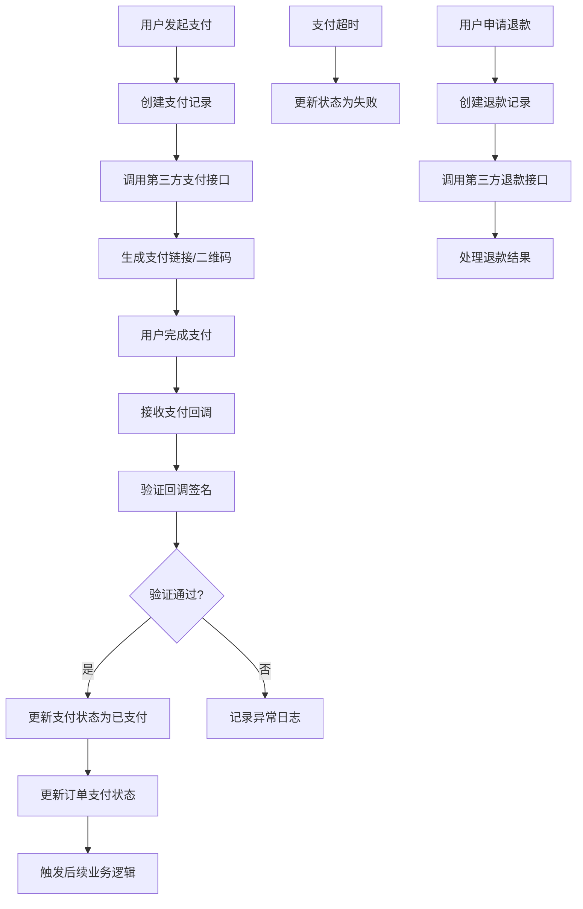

# 💳 支付模块功能说明文档

## 目录
- [模块概述](#模块概述)
- [系统架构](#系统架构)
- [核心功能](#核心功能)
- [API 接口详情](#api-接口详情)
- [数据模型](#数据模型)
- [支付流程](#支付流程)
- [状态管理](#状态管理)
- [技术实现](#技术实现)
- [第三方集成](#第三方集成)
- [使用示例](#使用示例)
- [安全机制](#安全机制)
- [常见问题](#常见问题)

---

## 模块概述

### 🎯 功能定位
支付模块是婴儿摄影工作室系统的关键财务模块，负责处理所有订单的支付相关业务。该模块管理支付记录、支付状态、退款处理等核心功能，为整个商业流程提供资金流管理支持，确保交易的安全性和可追溯性。

### 🚀 主要特性
- **多种支付方式**: 支持定金、全款、尾款等多种支付类型
- **完整的支付流程**: 创建、支付、确认、退款全流程管理
- **状态机管理**: 严格的支付状态流转控制
- **第三方集成**: 支持微信支付、支付宝等主流支付平台
- **安全保障**: 完善的支付安全机制和数据加密
- **对账功能**: 支持支付记录查询和财务对账

### 📊 业务价值
- 确保资金安全和交易可靠性
- 提供灵活的支付方式选择
- 支持财务管理和数据分析
- 提升用户支付体验
- 为业务决策提供财务数据支持

---

## 系统架构

### 🏗️ 模块结构
```
src/modules/payments/
├── dto/
│   ├── create-payment.dto.ts       # 创建支付DTO
│   └── update-payment.dto.ts       # 更新支付DTO（暂未使用）
├── payments.controller.ts          # 支付控制器
├── payments.service.ts             # 支付服务
├── payment-state-machine.service.ts # 支付状态机服务
└── payments.module.ts              # 支付模块
```

### 🔄 架构层次
1. **控制器层**: 处理HTTP请求，参数验证，响应格式化
2. **服务层**: 核心支付逻辑，状态管理，第三方接口调用
3. **状态机层**: 支付状态流转控制和验证
4. **数据访问层**: 通过Prisma进行数据库操作和事务处理
5. **集成层**: 第三方支付平台接口集成

### 🔗 依赖关系
- **PrismaModule**: 数据库访问服务
- **OrdersModule**: 订单信息关联
- **UsersModule**: 用户信息关联（间接）
- **第三方支付SDK**: 微信支付、支付宝等
- **加密服务**: 敏感数据加密和签名验证

---

## 核心功能

### 1. 支付记录创建
**功能描述**: 为订单创建支付记录，支持多种支付类型
- 订单关联验证
- 支付类型和金额验证
- 支付记录初始化
- 第三方支付订单创建
- 支付链接或二维码生成

### 2. 支付状态管理
**状态查询**: 实时查询支付状态
**状态更新**: 处理支付回调和状态变更
**状态同步**: 与第三方支付平台状态同步
**异常处理**: 处理支付异常和超时情况

### 3. 支付验证
**回调验证**: 验证第三方支付平台回调
**签名验证**: 确保支付数据的完整性和真实性
**金额验证**: 验证支付金额与订单金额的一致性
**重复验证**: 防止重复支付和恶意攻击

### 4. 退款处理
**退款申请**: 创建退款申请记录
**退款处理**: 调用第三方平台退款接口
**退款确认**: 处理退款结果和状态更新
**部分退款**: 支持订单的部分退款处理

---

## API 接口详情

### 📋 接口列表

| 方法 | 路径 | 功能 | 状态码 |
|------|------|------|--------|
| POST | `/payments` | 创建支付记录 | 201, 400, 404 |
| GET | `/payments` | 获取所有支付记录 | 200, 500 |
| GET | `/payments/order/:orderId` | 根据订单ID获取支付记录 | 200, 404 |
| GET | `/payments/:id` | 获取支付记录详情 | 200, 404 |
| PATCH | `/payments/:id` | 更新支付记录 | 200, 400, 404 |
| PATCH | `/payments/:id/status/:status` | 更新支付状态 | 200, 400, 404 |

### 🔍 接口详细说明

#### 1. 创建支付记录
```http
POST /payments
Content-Type: application/json

{
  "orderId": "1",
  "paymentType": "DEPOSIT",
  "amount": 200.00
}
```

**请求参数**:
- `orderId` (必填): 订单ID
- `paymentType` (必填): 支付类型 - DEPOSIT(定金) | FULL_PAYMENT(全款) | REMAINING(尾款)
- `amount` (必填): 支付金额，必须大于0

**响应示例**:
```json
{
  "id": 1,
  "orderId": 1,
  "paymentType": "DEPOSIT",
  "amount": 200.00,
  "status": "CREATED",
  "transactionId": null,
  "paidAt": null,
  "createdAt": "2024-07-25T10:30:00.000Z",
  "updatedAt": "2024-07-25T10:30:00.000Z",
  "order": {
    "id": 1,
    "orderNo": "ORD20240725001",
    "totalAmount": 899.00,
    "user": {
      "id": 1,
      "nickname": "小宝贝妈妈"
    },
    "package": {
      "id": 1,
      "name": "经典亲子摄影套餐"
    }
  },
  "paymentUrl": "https://pay.weixin.qq.com/xxx", // 支付链接
  "qrCode": "data:image/png;base64,xxx" // 支付二维码
}
```

#### 2. 获取所有支付记录
```http
GET /payments
```

**响应示例**:
```json
[
  {
    "id": 1,
    "orderId": 1,
    "paymentType": "DEPOSIT",
    "amount": 200.00,
    "status": "PAID",
    "transactionId": "wx_tx_123456789",
    "paidAt": "2024-07-25T10:35:00.000Z",
    "createdAt": "2024-07-25T10:30:00.000Z",
    "updatedAt": "2024-07-25T10:35:00.000Z",
    "order": {
      "id": 1,
      "orderNo": "ORD20240725001",
      "user": {
        "id": 1,
        "nickname": "小宝贝妈妈"
      }
    }
  }
]
```

#### 3. 根据订单ID获取支付记录
```http
GET /payments/order/1
```

**响应示例**: 返回该订单的所有支付记录数组

#### 4. 更新支付状态
```http
PATCH /payments/1/status/PAID
```

**支持的状态**:
- `CREATED`: 已创建
- `PAID`: 已支付
- `FAILED`: 支付失败
- `REFUNDED`: 已退款

**响应示例**: 返回更新后的支付记录

#### 5. 更新支付记录（通用更新）
```http
PATCH /payments/1
Content-Type: application/json

{
  "status": "PAID",
  "transactionId": "wx_tx_123456789",
  "paidAt": "2024-07-25T10:35:00.000Z"
}
```

---

## 数据模型

### 📊 支付数据结构
```typescript
interface Payment {
  id: number;              // 主键ID
  orderId: number;         // 订单ID
  paymentType: PaymentType; // 支付类型
  amount: number;          // 支付金额
  status: PaymentStatus;   // 支付状态
  transactionId?: string;  // 第三方交易ID
  platformType?: string;   // 支付平台类型（微信、支付宝等）
  paidAt?: Date;          // 支付完成时间
  refundedAt?: Date;      // 退款时间
  createdAt: Date;        // 创建时间
  updatedAt: Date;        // 更新时间
  
  // 关联关系
  order: Order;           // 关联订单
}
```

### 🏷️ 枚举定义
```typescript
enum PaymentType {
  DEPOSIT = 'DEPOSIT',           // 定金
  FULL_PAYMENT = 'FULL_PAYMENT', // 全款
  REMAINING = 'REMAINING'        // 尾款
}

enum PaymentStatus {
  CREATED = 'CREATED',     // 已创建，等待支付
  PAID = 'PAID',          // 已支付
  FAILED = 'FAILED',      // 支付失败
  REFUNDED = 'REFUNDED'   // 已退款
}

enum PlatformType {
  WECHAT = 'WECHAT',      // 微信支付
  ALIPAY = 'ALIPAY',      // 支付宝
  UNION = 'UNION',        // 银联
  CASH = 'CASH'           // 现金（线下）
}
```

### 🔗 关联关系
- **多对一**: Payment → Order (多个支付记录属于一个订单)
- **多对一**: Payment → User (通过订单关联用户)

### 📝 DTO 结构

#### CreatePaymentDto
```typescript
{
  orderId: string;        // 必填，订单ID
  paymentType: PaymentType; // 必填，支付类型
  amount: number;         // 必填，支付金额
}
```

#### UpdatePaymentDto
```typescript
{
  status?: PaymentStatus;    // 可选，支付状态
  transactionId?: string;    // 可选，第三方交易ID
  paidAt?: string;          // 可选，支付完成时间
  refundedAt?: string;      // 可选，退款时间
}
```

---

## 支付流程

### 💳 完整支付流程图


### 🔄 支付类型场景

#### 1. 定金支付流程
```typescript
// 定金支付业务逻辑
async processDepositPayment(orderId: number): Promise<Payment> {
  const order = await this.getOrder(orderId);
  const depositAmount = this.calculateDepositAmount(order.totalAmount);
  
  return await this.createPayment({
    orderId: orderId.toString(),
    paymentType: PaymentType.DEPOSIT,
    amount: depositAmount
  });
}

private calculateDepositAmount(totalAmount: number): number {
  // 定金计算逻辑，例如30%或固定金额
  return Math.min(totalAmount * 0.3, 500); // 30%且不超过500元
}
```

#### 2. 全款支付流程
```typescript
// 全款支付业务逻辑
async processFullPayment(orderId: number): Promise<Payment> {
  const order = await this.getOrder(orderId);
  
  // 检查是否已有定金支付
  const existingPayments = await this.getOrderPayments(orderId);
  const paidAmount = existingPayments
    .filter(p => p.status === PaymentStatus.PAID)
    .reduce((sum, p) => sum + p.amount, 0);
  
  if (paidAmount >= order.totalAmount) {
    throw new BadRequestException('订单已完成支付');
  }
  
  return await this.createPayment({
    orderId: orderId.toString(),
    paymentType: PaymentType.FULL_PAYMENT,
    amount: order.totalAmount - paidAmount
  });
}
```

#### 3. 尾款支付流程
```typescript
// 尾款支付业务逻辑
async processRemainingPayment(orderId: number): Promise<Payment> {
  const order = await this.getOrder(orderId);
  const existingPayments = await this.getOrderPayments(orderId);
  
  // 检查是否已有定金支付
  const depositPayment = existingPayments.find(
    p => p.paymentType === PaymentType.DEPOSIT && p.status === PaymentStatus.PAID
  );
  
  if (!depositPayment) {
    throw new BadRequestException('请先完成定金支付');
  }
  
  const remainingAmount = order.totalAmount - depositPayment.amount;
  
  return await this.createPayment({
    orderId: orderId.toString(),
    paymentType: PaymentType.REMAINING,
    amount: remainingAmount
  });
}
```

---

## 状态管理

### 🔄 支付状态机
```typescript
@Injectable()
export class PaymentStateMachineService {
  private readonly stateTransitions = {
    [PaymentStatus.CREATED]: [PaymentStatus.PAID, PaymentStatus.FAILED],
    [PaymentStatus.PAID]: [PaymentStatus.REFUNDED],
    [PaymentStatus.FAILED]: [PaymentStatus.CREATED], // 允许重新支付
    [PaymentStatus.REFUNDED]: [], // 终态
  };

  canTransition(from: PaymentStatus, to: PaymentStatus): boolean {
    return this.stateTransitions[from]?.includes(to) || false;
  }

  async transitionTo(paymentId: number, newStatus: PaymentStatus): Promise<Payment> {
    const payment = await this.paymentsService.findOne(paymentId);
    
    if (!this.canTransition(payment.status, newStatus)) {
      throw new BadRequestException(
        `Cannot transition from ${payment.status} to ${newStatus}`
      );
    }

    return await this.paymentsService.updateStatus(paymentId, newStatus);
  }

  async handlePaymentSuccess(paymentId: number, transactionId: string): Promise<void> {
    await this.prisma.$transaction(async (tx) => {
      // 更新支付状态
      await tx.payment.update({
        where: { id: paymentId },
        data: {
          status: PaymentStatus.PAID,
          transactionId,
          paidAt: new Date(),
        },
      });

      // 更新订单支付状态
      const payment = await tx.payment.findUnique({
        where: { id: paymentId },
        include: { order: true }
      });

      await this.updateOrderPaymentStatus(payment.orderId);
    });
  }

  private async updateOrderPaymentStatus(orderId: number): Promise<void> {
    const order = await this.prisma.order.findUnique({
      where: { id: orderId },
      include: { payments: true }
    });

    const totalPaid = order.payments
      .filter(p => p.status === PaymentStatus.PAID)
      .reduce((sum, p) => sum + p.amount, 0);

    let paymentStatus: string;
    if (totalPaid === 0) {
      paymentStatus = 'PENDING';
    } else if (totalPaid < order.totalAmount) {
      paymentStatus = 'PARTIAL_PAID';
    } else {
      paymentStatus = 'PAID';
    }

    await this.prisma.order.update({
      where: { id: orderId },
      data: { paymentStatus }
    });
  }
}
```

---

## 技术实现

### 🔧 核心技术栈
- **NestJS**: Web框架和依赖注入
- **Prisma**: ORM数据库访问
- **TypeScript**: 类型安全
- **微信支付SDK**: 微信支付接口集成
- **支付宝SDK**: 支付宝接口集成
- **crypto**: 加密和签名验证

### 📋 支付服务核心实现
```typescript
@Injectable()
export class PaymentsService {
  constructor(
    private readonly prisma: PrismaService,
    private readonly paymentStateMachine: PaymentStateMachineService,
    private readonly wechatPayService: WechatPayService,
    private readonly alipayService: AlipayService,
  ) {}

  async create(createPaymentDto: CreatePaymentDto): Promise<Payment> {
    return await this.prisma.$transaction(async (tx) => {
      // 1. 验证订单存在
      const order = await tx.order.findUnique({
        where: { id: parseInt(createPaymentDto.orderId) },
        include: {
          user: { select: { id: true, nickname: true, openid: true } },
          package: { select: { id: true, name: true, price: true } },
        },
      });

      if (!order) {
        throw new NotFoundException('订单不存在');
      }

      // 2. 验证支付金额
      await this.validatePaymentAmount(order, createPaymentDto);

      // 3. 创建支付记录
      const payment = await tx.payment.create({
        data: {
          orderId: parseInt(createPaymentDto.orderId),
          paymentType: createPaymentDto.paymentType,
          amount: createPaymentDto.amount,
          status: PaymentStatus.CREATED,
        },
        include: {
          order: {
            include: {
              user: { select: { id: true, nickname: true } },
              package: { select: { id: true, name: true } },
            },
          },
        },
      });

      // 4. 调用第三方支付接口
      const paymentInfo = await this.createThirdPartyPayment(payment);

      return {
        ...payment,
        ...paymentInfo,
      };
    });
  }

  private async validatePaymentAmount(
    order: any,
    createPaymentDto: CreatePaymentDto
  ): Promise<void> {
    const existingPayments = await this.prisma.payment.findMany({
      where: {
        orderId: order.id,
        status: PaymentStatus.PAID,
      },
    });

    const totalPaid = existingPayments.reduce((sum, p) => sum + p.amount, 0);
    const remainingAmount = order.totalAmount - totalPaid;

    if (createPaymentDto.amount > remainingAmount) {
      throw new BadRequestException('支付金额超过订单剩余金额');
    }

    if (createPaymentDto.amount <= 0) {
      throw new BadRequestException('支付金额必须大于0');
    }
  }

  private async createThirdPartyPayment(payment: Payment): Promise<any> {
    const { order } = payment;
    
    // 根据用户类型选择支付方式（这里默认微信支付）
    const paymentRequest = {
      out_trade_no: `PAY_${payment.id}_${Date.now()}`,
      total_fee: Math.round(payment.amount * 100), // 转为分
      body: `${order.package.name} - ${payment.paymentType}`,
      openid: order.user.openid,
    };

    try {
      const result = await this.wechatPayService.createOrder(paymentRequest);
      
      return {
        paymentUrl: result.code_url,
        qrCode: await this.generateQRCode(result.code_url),
        platformType: PlatformType.WECHAT,
      };
    } catch (error) {
      throw new BadRequestException(`创建支付订单失败: ${error.message}`);
    }
  }

  async handlePaymentCallback(callbackData: any): Promise<void> {
    try {
      // 1. 验证回调签名
      const isValid = await this.wechatPayService.verifyCallback(callbackData);
      if (!isValid) {
        throw new BadRequestException('回调签名验证失败');
      }

      // 2. 解析支付结果
      const { out_trade_no, transaction_id, result_code } = callbackData;
      const paymentId = this.extractPaymentIdFromTradeNo(out_trade_no);

      // 3. 更新支付状态
      if (result_code === 'SUCCESS') {
        await this.paymentStateMachine.handlePaymentSuccess(paymentId, transaction_id);
      } else {
        await this.updatePaymentStatus(paymentId, PaymentStatus.FAILED);
      }
    } catch (error) {
      console.error('支付回调处理失败:', error);
      throw error;
    }
  }

  async processRefund(paymentId: number, refundAmount?: number): Promise<void> {
    const payment = await this.findOne(paymentId);
    
    if (payment.status !== PaymentStatus.PAID) {
      throw new BadRequestException('只能退款已支付的订单');
    }

    const actualRefundAmount = refundAmount || payment.amount;
    
    if (actualRefundAmount > payment.amount) {
      throw new BadRequestException('退款金额不能超过支付金额');
    }

    try {
      const refundRequest = {
        out_trade_no: `PAY_${payment.id}_${Date.now()}`,
        out_refund_no: `REFUND_${payment.id}_${Date.now()}`,
        total_fee: Math.round(payment.amount * 100),
        refund_fee: Math.round(actualRefundAmount * 100),
      };

      const result = await this.wechatPayService.refund(refundRequest);
      
      if (result.result_code === 'SUCCESS') {
        await this.updatePaymentStatus(paymentId, PaymentStatus.REFUNDED);
      }
    } catch (error) {
      throw new BadRequestException(`退款处理失败: ${error.message}`);
    }
  }
}
```

---

## 第三方集成

### 🔌 微信支付集成
```typescript
@Injectable()
export class WechatPayService {
  private readonly appId: string;
  private readonly mchId: string;
  private readonly apiKey: string;
  private readonly notifyUrl: string;

  constructor(private readonly configService: ConfigService) {
    this.appId = configService.get('WECHAT_APP_ID');
    this.mchId = configService.get('WECHAT_MCH_ID');
    this.apiKey = configService.get('WECHAT_API_KEY');
    this.notifyUrl = configService.get('WECHAT_NOTIFY_URL');
  }

  async createOrder(orderData: WechatPayOrderRequest): Promise<WechatPayOrderResponse> {
    const params = {
      appid: this.appId,
      mch_id: this.mchId,
      nonce_str: this.generateNonceStr(),
      body: orderData.body,
      out_trade_no: orderData.out_trade_no,
      total_fee: orderData.total_fee,
      spbill_create_ip: '127.0.0.1',
      notify_url: this.notifyUrl,
      trade_type: 'NATIVE', // 扫码支付
    };

    // 生成签名
    params.sign = this.generateSign(params);

    // 调用微信支付API
    const xml = this.objectToXml(params);
    const response = await this.httpPost('https://api.mch.weixin.qq.com/pay/unifiedorder', xml);
    
    return this.xmlToObject(response);
  }

  async verifyCallback(callbackData: any): Promise<boolean> {
    const { sign, ...params } = callbackData;
    const expectedSign = this.generateSign(params);
    
    return sign === expectedSign;
  }

  async refund(refundData: WechatRefundRequest): Promise<WechatRefundResponse> {
    const params = {
      appid: this.appId,
      mch_id: this.mchId,
      nonce_str: this.generateNonceStr(),
      out_trade_no: refundData.out_trade_no,
      out_refund_no: refundData.out_refund_no,
      total_fee: refundData.total_fee,
      refund_fee: refundData.refund_fee,
    };

    params.sign = this.generateSign(params);

    const xml = this.objectToXml(params);
    const response = await this.httpPost('https://api.mch.weixin.qq.com/secapi/pay/refund', xml);
    
    return this.xmlToObject(response);
  }

  private generateSign(params: any): string {
    const sortedParams = Object.keys(params)
      .filter(key => params[key] !== '' && key !== 'sign')
      .sort()
      .map(key => `${key}=${params[key]}`)
      .join('&');
    
    const stringToSign = `${sortedParams}&key=${this.apiKey}`;
    
    return crypto.createHash('md5').update(stringToSign, 'utf8').digest('hex').toUpperCase();
  }

  private generateNonceStr(): string {
    return crypto.randomBytes(16).toString('hex');
  }

  private objectToXml(obj: any): string {
    let xml = '<xml>';
    for (const key in obj) {
      xml += `<${key}><![CDATA[${obj[key]}]]></${key}>`;
    }
    xml += '</xml>';
    return xml;
  }

  private xmlToObject(xml: string): any {
    // XML解析实现
    // 这里简化处理，实际应用中建议使用xml2js等库
    const result = {};
    const regex = /<(\w+)><!\[CDATA\[(.*?)\]\]><\/\1>/g;
    let match;
    
    while ((match = regex.exec(xml)) !== null) {
      result[match[1]] = match[2];
    }
    
    return result;
  }

  private async httpPost(url: string, data: string): Promise<string> {
    // HTTP请求实现
    // 这里需要使用node.js的http模块或axios等库
    const response = await fetch(url, {
      method: 'POST',
      headers: { 'Content-Type': 'application/xml' },
      body: data,
    });
    
    return response.text();
  }
}
```

### 💰 支付宝集成
```typescript
@Injectable()
export class AlipayService {
  private readonly appId: string;
  private readonly privateKey: string;
  private readonly alipayPublicKey: string;
  private readonly gatewayUrl: string;

  constructor(private readonly configService: ConfigService) {
    this.appId = configService.get('ALIPAY_APP_ID');
    this.privateKey = configService.get('ALIPAY_PRIVATE_KEY');
    this.alipayPublicKey = configService.get('ALIPAY_PUBLIC_KEY');
    this.gatewayUrl = 'https://openapi.alipay.com/gateway.do';
  }

  async createOrder(orderData: AlipayOrderRequest): Promise<AlipayOrderResponse> {
    const params = {
      app_id: this.appId,
      method: 'alipay.trade.precreate',
      charset: 'utf-8',
      sign_type: 'RSA2',
      timestamp: new Date().toISOString().replace('T', ' ').substring(0, 19),
      version: '1.0',
      biz_content: JSON.stringify({
        out_trade_no: orderData.out_trade_no,
        total_amount: orderData.total_amount,
        subject: orderData.subject,
      }),
    };

    // 生成签名
    params.sign = this.generateSign(params);

    // 调用支付宝API
    const response = await this.httpPost(this.gatewayUrl, params);
    
    return JSON.parse(response);
  }

  async verifyCallback(callbackData: any): Promise<boolean> {
    const { sign, sign_type, ...params } = callbackData;
    
    // 参数排序和拼接
    const sortedParams = Object.keys(params)
      .sort()
      .map(key => `${key}=${params[key]}`)
      .join('&');

    // 验证签名
    const verify = crypto.createVerify('RSA-SHA256');
    verify.update(sortedParams, 'utf8');
    
    return verify.verify(this.alipayPublicKey, sign, 'base64');
  }

  private generateSign(params: any): string {
    const sortedParams = Object.keys(params)
      .filter(key => params[key] !== '' && key !== 'sign')
      .sort()
      .map(key => `${key}=${params[key]}`)
      .join('&');

    const sign = crypto.createSign('RSA-SHA256');
    sign.update(sortedParams, 'utf8');
    
    return sign.sign(this.privateKey, 'base64');
  }

  private async httpPost(url: string, params: any): Promise<string> {
    const queryString = new URLSearchParams(params).toString();
    
    const response = await fetch(url, {
      method: 'POST',
      headers: { 'Content-Type': 'application/x-www-form-urlencoded' },
      body: queryString,
    });
    
    return response.text();
  }
}
```

---

## 使用示例

### 🎯 前端集成示例

#### 微信小程序支付集成
```javascript
// 支付页面
Page({
  data: {
    order: null,
    paymentType: 'DEPOSIT', // DEPOSIT, FULL_PAYMENT, REMAINING
    paymentAmount: 0,
    loading: false
  },

  onLoad(options) {
    const orderId = options.orderId;
    this.loadOrderInfo(orderId);
  },

  async loadOrderInfo(orderId) {
    try {
      const res = await wx.request({
        url: `https://api.example.com/orders/${orderId}`,
        method: 'GET'
      });

      const order = res.data;
      const depositAmount = order.totalAmount * 0.3; // 30%定金

      this.setData({
        order,
        paymentAmount: this.data.paymentType === 'DEPOSIT' ? depositAmount : order.totalAmount
      });
    } catch (error) {
      wx.showToast({ title: '加载订单失败', icon: 'error' });
    }
  },

  onPaymentTypeChange(e) {
    const paymentType = e.detail.value;
    const { order } = this.data;
    
    let paymentAmount = 0;
    if (paymentType === 'DEPOSIT') {
      paymentAmount = order.totalAmount * 0.3;
    } else if (paymentType === 'FULL_PAYMENT') {
      paymentAmount = order.totalAmount;
    } else if (paymentType === 'REMAINING') {
      // 计算尾款金额
      paymentAmount = this.calculateRemainingAmount(order);
    }

    this.setData({
      paymentType,
      paymentAmount
    });
  },

  async createPayment() {
    if (this.data.loading) return;

    this.setData({ loading: true });

    try {
      // 1. 创建支付记录
      const paymentRes = await wx.request({
        url: 'https://api.example.com/payments',
        method: 'POST',
        data: {
          orderId: this.data.order.id.toString(),
          paymentType: this.data.paymentType,
          amount: this.data.paymentAmount
        }
      });

      const payment = paymentRes.data;

      // 2. 调用微信支付
      const paymentResult = await wx.requestPayment({
        timeStamp: payment.timeStamp,
        nonceStr: payment.nonceStr,
        package: payment.package,
        signType: 'MD5',
        paySign: payment.paySign
      });

      // 3. 支付成功处理
      wx.showToast({ title: '支付成功', icon: 'success' });
      
      // 跳转到支付结果页
      wx.redirectTo({
        url: `/pages/payment-result/payment-result?paymentId=${payment.id}&status=success`
      });

    } catch (error) {
      if (error.errMsg === 'requestPayment:fail cancel') {
        wx.showToast({ title: '支付已取消', icon: 'none' });
      } else {
        wx.showToast({ title: '支付失败', icon: 'error' });
      }
    } finally {
      this.setData({ loading: false });
    }
  },

  calculateRemainingAmount(order) {
    // 计算尾款：总金额 - 已支付金额
    const paidAmount = order.payments
      .filter(p => p.status === 'PAID')
      .reduce((sum, p) => sum + p.amount, 0);
    
    return order.totalAmount - paidAmount;
  }
});
```

#### React 支付组件
```typescript
// 支付服务类
class PaymentService {
  private baseURL = '/api/payments';

  async createPayment(paymentData: CreatePaymentDto): Promise<Payment> {
    const response = await fetch(this.baseURL, {
      method: 'POST',
      headers: { 'Content-Type': 'application/json' },
      body: JSON.stringify(paymentData),
    });
    
    if (!response.ok) {
      const error = await response.json();
      throw new Error(error.message || '创建支付失败');
    }
    
    return response.json();
  }

  async getOrderPayments(orderId: number): Promise<Payment[]> {
    const response = await fetch(`${this.baseURL}/order/${orderId}`);
    if (!response.ok) throw new Error('获取支付记录失败');
    return response.json();
  }

  async checkPaymentStatus(paymentId: number): Promise<Payment> {
    const response = await fetch(`${this.baseURL}/${paymentId}`);
    if (!response.ok) throw new Error('查询支付状态失败');
    return response.json();
  }
}

// React Hook
function usePayment(orderId: number) {
  const [payments, setPayments] = useState<Payment[]>([]);
  const [loading, setLoading] = useState(false);
  const [error, setError] = useState<string | null>(null);

  const paymentService = new PaymentService();

  const fetchPayments = useCallback(async () => {
    setLoading(true);
    setError(null);

    try {
      const data = await paymentService.getOrderPayments(orderId);
      setPayments(data);
    } catch (err) {
      setError(err instanceof Error ? err.message : '获取支付记录失败');
    } finally {
      setLoading(false);
    }
  }, [orderId]);

  useEffect(() => {
    if (orderId) {
      fetchPayments();
    }
  }, [orderId, fetchPayments]);

  const createPayment = async (paymentData: CreatePaymentDto) => {
    try {
      const newPayment = await paymentService.createPayment(paymentData);
      setPayments(prev => [newPayment, ...prev]);
      return newPayment;
    } catch (err) {
      setError(err instanceof Error ? err.message : '创建支付失败');
      throw err;
    }
  };

  const checkPaymentStatus = async (paymentId: number) => {
    try {
      const updatedPayment = await paymentService.checkPaymentStatus(paymentId);
      setPayments(prev => prev.map(p => 
        p.id === paymentId ? updatedPayment : p
      ));
      return updatedPayment;
    } catch (err) {
      setError(err instanceof Error ? err.message : '查询状态失败');
      throw err;
    }
  };

  return {
    payments,
    loading,
    error,
    createPayment,
    checkPaymentStatus,
    refresh: fetchPayments,
  };
}

// 支付组件
function PaymentComponent({ order }: { order: Order }) {
  const { payments, createPayment, checkPaymentStatus } = usePayment(order.id);
  const [selectedPaymentType, setSelectedPaymentType] = useState<PaymentType>('DEPOSIT');
  const [processing, setProcessing] = useState(false);

  const calculatePaymentAmount = (type: PaymentType): number => {
    const paidAmount = payments
      .filter(p => p.status === 'PAID')
      .reduce((sum, p) => sum + p.amount, 0);

    switch (type) {
      case 'DEPOSIT':
        return order.totalAmount * 0.3; // 30%定金
      case 'FULL_PAYMENT':
        return order.totalAmount - paidAmount;
      case 'REMAINING':
        return order.totalAmount - paidAmount;
      default:
        return 0;
    }
  };

  const handlePayment = async () => {
    if (processing) return;

    setProcessing(true);

    try {
      const paymentAmount = calculatePaymentAmount(selectedPaymentType);
      
      if (paymentAmount <= 0) {
        alert('支付金额必须大于0');
        return;
      }

      // 创建支付记录
      const payment = await createPayment({
        orderId: order.id.toString(),
        paymentType: selectedPaymentType,
        amount: paymentAmount,
      });

      // 模拟支付流程（实际应用中会跳转到支付页面）
      const paymentSuccess = await simulatePayment(payment);

      if (paymentSuccess) {
        // 检查支付状态更新
        await checkPaymentStatus(payment.id);
        alert('支付成功！');
      } else {
        alert('支付失败，请重试');
      }
    } catch (error) {
      alert(`支付失败: ${error.message}`);
    } finally {
      setProcessing(false);
    }
  };

  const simulatePayment = (payment: Payment): Promise<boolean> => {
    return new Promise((resolve) => {
      // 模拟支付处理时间
      setTimeout(() => {
        resolve(Math.random() > 0.1); // 90%成功率
      }, 2000);
    });
  };

  const getPaymentTypeText = (type: PaymentType): string => {
    const texts = {
      DEPOSIT: '定金支付',
      FULL_PAYMENT: '全款支付',
      REMAINING: '尾款支付',
    };
    return texts[type];
  };

  const getStatusText = (status: PaymentStatus): string => {
    const texts = {
      CREATED: '等待支付',
      PAID: '已支付',
      FAILED: '支付失败',
      REFUNDED: '已退款',
    };
    return texts[status];
  };

  return (
    <div className="payment-component">
      <div className="order-info">
        <h3>订单信息</h3>
        <p>订单号: {order.orderNo}</p>
        <p>套餐: {order.package.name}</p>
        <p>总金额: ¥{order.totalAmount}</p>
      </div>

      <div className="payment-history">
        <h4>支付记录</h4>
        {payments.length === 0 ? (
          <p>暂无支付记录</p>
        ) : (
          <div className="payment-list">
            {payments.map(payment => (
              <div key={payment.id} className="payment-item">
                <span>{getPaymentTypeText(payment.paymentType)}</span>
                <span>¥{payment.amount}</span>
                <span className={`status ${payment.status.toLowerCase()}`}>
                  {getStatusText(payment.status)}
                </span>
                {payment.paidAt && (
                  <span>{format(new Date(payment.paidAt), 'yyyy-MM-dd HH:mm')}</span>
                )}
              </div>
            ))}
          </div>
        )}
      </div>

      <div className="payment-form">
        <h4>新建支付</h4>
        
        <div className="payment-type-selector">
          <label>
            <input
              type="radio"
              value="DEPOSIT"
              checked={selectedPaymentType === 'DEPOSIT'}
              onChange={(e) => setSelectedPaymentType(e.target.value as PaymentType)}
            />
            定金支付 (30%)
          </label>
          <label>
            <input
              type="radio"
              value="FULL_PAYMENT"
              checked={selectedPaymentType === 'FULL_PAYMENT'}
              onChange={(e) => setSelectedPaymentType(e.target.value as PaymentType)}
            />
            全款支付
          </label>
          <label>
            <input
              type="radio"
              value="REMAINING"
              checked={selectedPaymentType === 'REMAINING'}
              onChange={(e) => setSelectedPaymentType(e.target.value as PaymentType)}
            />
            尾款支付
          </label>
        </div>

        <div className="payment-amount">
          支付金额: ¥{calculatePaymentAmount(selectedPaymentType)}
        </div>

        <button
          className="pay-button"
          onClick={handlePayment}
          disabled={processing || calculatePaymentAmount(selectedPaymentType) <= 0}
        >
          {processing ? '处理中...' : '立即支付'}
        </button>
      </div>
    </div>
  );
}
```

---

## 安全机制

### 🔐 数据安全
```typescript
// 敏感数据加密服务
@Injectable()
export class EncryptionService {
  private readonly algorithm = 'aes-256-gcm';
  private readonly secretKey: string;

  constructor(private readonly configService: ConfigService) {
    this.secretKey = configService.get('ENCRYPTION_SECRET_KEY');
  }

  encrypt(text: string): { encrypted: string; iv: string; tag: string } {
    const iv = crypto.randomBytes(16);
    const cipher = crypto.createCipher(this.algorithm, this.secretKey);
    cipher.setAAD(Buffer.from('payment', 'utf8'));

    let encrypted = cipher.update(text, 'utf8', 'hex');
    encrypted += cipher.final('hex');

    const tag = cipher.getAuthTag();

    return {
      encrypted,
      iv: iv.toString('hex'),
      tag: tag.toString('hex'),
    };
  }

  decrypt(encrypted: string, iv: string, tag: string): string {
    const decipher = crypto.createDecipher(this.algorithm, this.secretKey);
    decipher.setAAD(Buffer.from('payment', 'utf8'));
    decipher.setAuthTag(Buffer.from(tag, 'hex'));

    let decrypted = decipher.update(encrypted, 'hex', 'utf8');
    decrypted += decipher.final('utf8');

    return decrypted;
  }
}

// 支付数据安全处理
@Injectable()
export class PaymentSecurityService {
  constructor(private readonly encryptionService: EncryptionService) {}

  async secureSavePayment(paymentData: any): Promise<Payment> {
    // 加密敏感字段
    if (paymentData.transactionId) {
      const encrypted = this.encryptionService.encrypt(paymentData.transactionId);
      paymentData.encryptedTransactionId = JSON.stringify(encrypted);
      delete paymentData.transactionId; // 删除明文
    }

    return await this.prisma.payment.create({ data: paymentData });
  }

  async secureGetPayment(paymentId: number): Promise<Payment> {
    const payment = await this.prisma.payment.findUnique({
      where: { id: paymentId }
    });

    // 解密敏感字段
    if (payment.encryptedTransactionId) {
      const encryptedData = JSON.parse(payment.encryptedTransactionId);
      payment.transactionId = this.encryptionService.decrypt(
        encryptedData.encrypted,
        encryptedData.iv,
        encryptedData.tag
      );
    }

    return payment;
  }
}
```

### 🛡️ 防重复支付
```typescript
@Injectable()
export class PaymentDeduplicationService {
  private readonly redis: Redis;

  constructor(
    @Inject('REDIS_CLIENT') redis: Redis,
    private readonly prisma: PrismaService,
  ) {
    this.redis = redis;
  }

  async checkAndLockPayment(orderId: number, paymentType: PaymentType): Promise<string> {
    const lockKey = `payment_lock:${orderId}:${paymentType}`;
    const lockValue = `${Date.now()}_${Math.random()}`;
    const lockExpire = 300; // 5分钟锁定时间

    // 尝试获取锁
    const result = await this.redis.set(lockKey, lockValue, 'EX', lockExpire, 'NX');
    
    if (!result) {
      throw new ConflictException('支付正在处理中，请稍后再试');
    }

    // 检查是否已有相同类型的支付记录
    const existingPayment = await this.prisma.payment.findFirst({
      where: {
        orderId,
        paymentType,
        status: { in: ['CREATED', 'PAID'] },
      },
    });

    if (existingPayment) {
      // 释放锁
      await this.releaseLock(lockKey, lockValue);
      throw new ConflictException('已存在相同类型的支付记录');
    }

    return lockValue;
  }

  async releaseLock(lockKey: string, lockValue: string): Promise<void> {
    const script = `
      if redis.call("get", KEYS[1]) == ARGV[1] then
        return redis.call("del", KEYS[1])
      else
        return 0
      end
    `;

    await this.redis.eval(script, 1, lockKey, lockValue);
  }

  async processPaymentWithLock(
    orderId: number,
    paymentType: PaymentType,
    amount: number,
    lockValue: string,
  ): Promise<Payment> {
    const lockKey = `payment_lock:${orderId}:${paymentType}`;

    try {
      // 创建支付记录
      const payment = await this.prisma.payment.create({
        data: {
          orderId,
          paymentType,
          amount,
          status: PaymentStatus.CREATED,
        },
      });

      return payment;
    } finally {
      // 确保释放锁
      await this.releaseLock(lockKey, lockValue);
    }
  }
}
```

---

## 常见问题

### ❓ FAQ

#### Q1: 如何处理支付回调的幂等性？
**A**: 使用Redis缓存回调处理状态，确保相同回调只处理一次。

```typescript
async handlePaymentCallbackIdempotent(callbackData: any): Promise<void> {
  const { transaction_id } = callbackData;
  const cacheKey = `payment_callback:${transaction_id}`;
  
  // 检查是否已处理
  const processed = await this.redis.get(cacheKey);
  if (processed) {
    return; // 已处理，直接返回
  }

  // 设置处理标记，有效期24小时
  await this.redis.setex(cacheKey, 86400, 'processed');

  try {
    await this.handlePaymentCallback(callbackData);
  } catch (error) {
    // 处理失败，删除标记
    await this.redis.del(cacheKey);
    throw error;
  }
}
```

#### Q2: 如何实现支付超时自动取消？
**A**: 使用定时任务检查超时支付并自动取消。

```typescript
@Cron('0 */5 * * * *') // 每5分钟执行一次
async cancelTimeoutPayments(): Promise<void> {
  const timeoutPayments = await this.prisma.payment.findMany({
    where: {
      status: PaymentStatus.CREATED,
      createdAt: {
        lte: new Date(Date.now() - 30 * 60 * 1000), // 30分钟前
      },
    },
  });

  for (const payment of timeoutPayments) {
    await this.updatePaymentStatus(payment.id, PaymentStatus.FAILED);
  }
}
```

#### Q3: 如何处理部分退款场景？
**A**: 创建负金额的退款记录，跟踪退款历史。

```typescript
async processPartialRefund(
  originalPaymentId: number,
  refundAmount: number,
  reason: string
): Promise<Payment> {
  const originalPayment = await this.findOne(originalPaymentId);
  
  // 创建退款记录
  const refundPayment = await this.prisma.payment.create({
    data: {
      orderId: originalPayment.orderId,
      paymentType: originalPayment.paymentType,
      amount: -refundAmount, // 负数表示退款
      status: PaymentStatus.CREATED,
      relatedPaymentId: originalPaymentId, // 关联原支付记录
      refundReason: reason,
    },
  });

  // 调用第三方退款接口
  await this.processThirdPartyRefund(refundPayment);

  return refundPayment;
}
```

#### Q4: 如何实现支付数据的审计日志？
**A**: 创建支付操作审计表，记录所有关键操作。

```typescript
// 支付审计模型
model PaymentAudit {
  id          Int      @id @default(autoincrement())
  paymentId   Int
  action      String   // CREATE, UPDATE, REFUND, CANCEL
  oldData     Json?    // 操作前数据
  newData     Json?    // 操作后数据
  operatorId  Int?     // 操作人ID
  operatorType String  // USER, SYSTEM, ADMIN
  ipAddress   String?
  userAgent   String?
  createdAt   DateTime @default(now())
}

// 审计服务
@Injectable()
export class PaymentAuditService {
  async logPaymentAction(
    paymentId: number,
    action: string,
    oldData: any,
    newData: any,
    context: any
  ): Promise<void> {
    await this.prisma.paymentAudit.create({
      data: {
        paymentId,
        action,
        oldData,
        newData,
        operatorId: context.userId,
        operatorType: context.userType || 'SYSTEM',
        ipAddress: context.ip,
        userAgent: context.userAgent,
      },
    });
  }
}
```

#### Q5: 如何实现支付的风控检查？
**A**: 在支付创建前进行风险评估和检查。

```typescript
@Injectable()
export class PaymentRiskControlService {
  async checkPaymentRisk(
    userId: number,
    amount: number,
    paymentType: PaymentType
  ): Promise<RiskCheckResult> {
    const risks = [];

    // 1. 检查用户支付频率
    const recentPayments = await this.getRecentPayments(userId, 24); // 24小时内
    if (recentPayments.length > 10) {
      risks.push('支付频率过高');
    }

    // 2. 检查支付金额异常
    const avgAmount = await this.getUserAveragePaymentAmount(userId);
    if (amount > avgAmount * 5) {
      risks.push('支付金额异常');
    }

    // 3. 检查黑名单
    const isBlacklisted = await this.checkUserBlacklist(userId);
    if (isBlacklisted) {
      risks.push('用户在黑名单中');
    }

    return {
      isRisky: risks.length > 0,
      riskLevel: this.calculateRiskLevel(risks),
      risks,
      needManualReview: risks.length >= 2,
    };
  }

  async processPaymentWithRiskCheck(createPaymentDto: CreatePaymentDto): Promise<Payment> {
    const order = await this.getOrder(parseInt(createPaymentDto.orderId));
    const riskResult = await this.checkPaymentRisk(
      order.userId,
      createPaymentDto.amount,
      createPaymentDto.paymentType
    );

    if (riskResult.needManualReview) {
      // 创建待审核的支付记录
      return await this.createPendingReviewPayment(createPaymentDto, riskResult);
    }

    if (riskResult.isRisky) {
      // 记录风险日志但允许支付
      await this.logPaymentRisk(createPaymentDto, riskResult);
    }

    return await this.create(createPaymentDto);
  }
}
```

---

## 总结

支付模块是整个婴儿摄影工作室系统的关键财务模块，提供了：

✅ **完整的支付流程管理**: 从创建到完成的全流程控制  
✅ **多种支付方式支持**: 定金、全款、尾款等灵活支付选项  
✅ **严格的状态管理**: 基于状态机的支付状态流转控制  
✅ **安全的支付保障**: 加密存储、签名验证、防重复支付等安全机制  
✅ **完善的第三方集成**: 微信支付、支付宝等主流支付平台集成  
✅ **详细的审计追踪**: 完整的支付操作日志和数据审计  
✅ **智能的风控检查**: 多维度的支付风险评估和控制  

该模块为整个业务系统提供了安全、可靠、灵活的支付解决方案，满足各种支付场景和业务需求。

---

*文档版本: 1.0.0*  
*最后更新: 2024年7月25日*  
*维护者: 开发团队*
