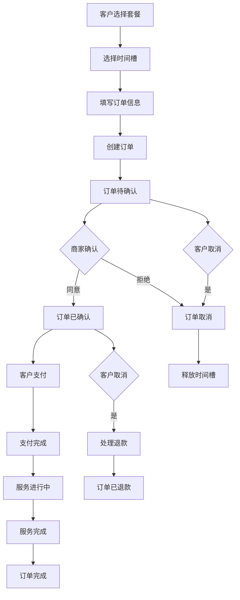

# 📋 订单模块功能说明文档

## 目录
- [模块概述](#模块概述)
- [系统架构](#系统架构)
- [核心功能](#核心功能)
- [API 接口详情](#api-接口详情)
- [API 测试参数示例](#api-测试参数示例)
- [数据模型](#数据模型)
- [业务逻辑](#业务逻辑)
- [状态管理](#状态管理)
- [技术实现](#技术实现)
- [使用示例](#使用示例)
- [订单处理流程](#订单处理流程)
- [常见问题](#常见问题)

---

## 模块概述

### 🎯 功能定位
订单模块是婴儿摄影工作室系统的核心业务模块，负责管理整个预约和服务流程。该模块连接用户、套餐、时间槽和支付等其他模块，实现完整的订单生命周期管理，是整个业务流程的中枢系统。

### 🚀 主要特性
- **完整的订单管理**: 创建、查询、更新、取消订单
- **智能时间槽管理**: 自动处理时间槽预订和释放
- **多维度查询**: 支持按用户、订单号、状态等多种方式查询
- **状态流转控制**: 严格的订单状态管理和流转控制
- **关联数据处理**: 完整的用户、套餐、时间槽、支付关联
- **业务规则保护**: 完善的业务逻辑验证和数据完整性保护

### 📊 业务价值
- 统一管理所有预约和服务订单
- 提供完整的客户服务流程跟踪
- 支持精细化的订单状态管理
- 便于客服和运营团队进行订单处理
- 为财务和统计分析提供数据基础

---

## 系统架构

### 🏗️ 模块结构
```
src/modules/orders/
├── dto/
│   ├── create-order.dto.ts     # 创建订单DTO
│   ├── update-order.dto.ts     # 更新订单DTO
│   └── create-payment.dto.ts   # 创建支付DTO（关联使用）
├── orders.controller.ts        # 订单控制器
├── orders.service.ts           # 订单服务
└── orders.module.ts            # 订单模块
```

### 🔄 架构层次
1. **控制器层**: 处理HTTP请求，参数验证，响应格式化
2. **服务层**: 核心业务逻辑，状态管理，事务处理
3. **数据访问层**: 通过Prisma进行复杂的关联查询和事务操作
4. **DTO层**: 数据传输对象，确保类型安全和验证

### 🔗 依赖关系
- **PrismaModule**: 数据库访问服务
- **UsersModule**: 用户信息关联
- **PackagesModule**: 套餐信息关联
- **TimeSlotsModule**: 时间槽管理（隐式依赖）
- **PaymentsModule**: 支付信息关联（隐式依赖）

---

## 核心功能

### 1. 订单创建
**功能描述**: 创建新订单，关联用户、套餐和时间槽
- 用户信息验证和关联
- 套餐有效性检查
- 时间槽可用性验证和预订
- 订单号自动生成
- 初始状态设置和数据完整性保护

### 2. 订单查询
**全量查询**: 获取所有订单，支持管理后台
**用户查询**: 根据用户ID查询用户的所有订单
**订单号查询**: 根据订单号快速定位订单
**单个查询**: 根据订单ID获取详细信息
**关联查询**: 包含用户、套餐、时间槽、支付等完整信息

### 3. 订单更新
**状态更新**: 支持订单状态流转（待支付→已支付→已完成等）
**时间槽变更**: 智能处理时间槽的释放和重新预订
**信息修改**: 支持订单备注、联系方式等信息更新
**关联数据同步**: 确保相关数据的一致性

### 4. 订单管理
**取消订单**: 处理订单取消，释放时间槽，处理退款
**完成订单**: 标记订单完成，更新相关状态
**异常处理**: 处理各种异常情况和数据恢复

---

## API 接口详情

### 📋 接口列表

| 方法 | 路径 | 功能 | 状态码 |
|------|------|------|--------|
| POST | `/orders` | 创建订单 | 201, 400, 409 |
| GET | `/orders` | 获取所有订单 | 200, 500 |
| GET | `/orders/user/:userId` | 根据用户ID获取订单 | 200, 404 |
| GET | `/orders/order-no/:orderNo` | 根据订单号获取订单 | 200, 404 |
| GET | `/orders/:id` | 获取订单详情 | 200, 404 |
| PATCH | `/orders/:id` | 更新订单信息 | 200, 400, 404 |

### 🔍 接口详细说明

#### 1. 创建订单
```http
POST /orders
Content-Type: application/json

{
  "userId": 1,
  "packageId": 1,
  "timeSlotId": 5,
  "contactPhone": "13800138000",
  "notes": "希望拍摄温馨的亲子照片"
}
```

**请求参数**:
- `userId` (必填): 用户ID
- `packageId` (必填): 套餐ID
- `timeSlotId` (必填): 时间槽ID
- `contactPhone` (必填): 联系电话
- `notes` (可选): 订单备注

**响应示例**:
```json
{
  "id": 1,
  "orderNo": "ORD20240725001",
  "userId": 1,
  "packageId": 1,
  "timeSlotId": 5,
  "contactPhone": "13800138000",
  "notes": "希望拍摄温馨的亲子照片",
  "status": "PENDING",
  "paymentStatus": "PENDING",
  "totalAmount": 899.00,
  "createdAt": "2024-07-25T10:30:00.000Z",
  "updatedAt": "2024-07-25T10:30:00.000Z",
  "user": {
    "id": 1,
    "nickname": "小宝贝妈妈",
    "phone": "13800138000"
  },
  "package": {
    "id": 1,
    "name": "经典亲子摄影套餐",
    "price": 899.00,
    "duration": 120
  },
  "timeSlot": {
    "id": 5,
    "date": "2024-08-15T00:00:00.000Z",
    "startTime": "1970-01-01T09:00:00.000Z",
    "endTime": "1970-01-01T11:00:00.000Z",
    "isBooked": true
  }
}
```

#### 2. 获取所有订单
```http
GET /orders
```

**响应示例**:
```json
[
  {
    "id": 1,
    "orderNo": "ORD20240725001",
    "userId": 1,
    "packageId": 1,
    "timeSlotId": 5,
    "contactPhone": "13800138000",
    "notes": "希望拍摄温馨的亲子照片",
    "status": "PENDING",
    "paymentStatus": "PENDING",
    "totalAmount": 899.00,
    "createdAt": "2024-07-25T10:30:00.000Z",
    "updatedAt": "2024-07-25T10:30:00.000Z",
    "user": {
      "id": 1,
      "nickname": "小宝贝妈妈",
      "phone": "13800138000"
    },
    "package": {
      "id": 1,
      "name": "经典亲子摄影套餐",
      "price": 899.00
    },
    "timeSlot": {
      "id": 5,
      "date": "2024-08-15T00:00:00.000Z",
      "startTime": "1970-01-01T09:00:00.000Z",
      "endTime": "1970-01-01T11:00:00.000Z"
    }
  }
]
```

#### 3. 根据用户ID获取订单
```http
GET /orders/user/1
```

**响应示例**: 与获取所有订单相同的数据结构，但只包含该用户的订单

#### 4. 根据订单号获取订单
```http
GET /orders/order-no/ORD20240725001
```

**响应示例**: 单个订单的详细信息

#### 5. 更新订单信息
```http
PATCH /orders/1
Content-Type: application/json

{
  "status": "CONFIRMED",
  "timeSlotId": 8,
  "notes": "更新备注：客户要求更换拍摄时间"
}
```

**支持更新的字段**:
- `status`: 订单状态
- `paymentStatus`: 支付状态
- `timeSlotId`: 时间槽ID（会自动处理时间槽变更）
- `contactPhone`: 联系电话
- `notes`: 订单备注

**响应示例**: 返回更新后的完整订单信息

### 🧪 API 测试参数示例

本部分提供了可在 Swagger UI (`/api/docs`) 中直接使用的测试参数。

**注意**: 在测试前，请确保数据库中存在有效的用户、套餐和时间槽记录。以下示例假设 `userId: 1`, `packageId: 1`, `timeSlotId: 5` 是有效的。

#### 1. 创建订单 (POST /orders)

**请求体示例:**
```json
{
  "userId": 1,
  "packageId": 1,
  "timeSlotId": 5,
  "contactPhone": "13912345678",
  "notes": "宝宝对闪光灯敏感，请注意。"
}
```

#### 2. 获取所有订单 (GET /orders)

此接口无需参数。

#### 3. 根据用户ID获取订单 (GET /orders/user/:userId)

- **userId**: `1`

#### 4. 根据订单号获取订单 (GET /orders/order-no/:orderNo)

- **orderNo**: `ORD20240725001` (请使用一个已存在的订单号)

#### 5. 获取订单详情 (GET /orders/:id)

- **id**: `1` (请使用一个已存在的订单ID)

#### 6. 更新订单信息 (PATCH /orders/:id)

- **id**: `1` (请使用一个已存在的订单ID)

**请求体示例1: 更新状态**
```json
{
  "status": "CONFIRMED"
}
```

**请求体示例2: 更新备注和联系电话**
```json
{
  "contactPhone": "13888888888",
  "notes": "客户已确认，准备拍摄。"
}
```

---

## 数据模型

### 📊 订单数据结构
```typescript
interface Order {
  id: number;            // 主键ID
  orderNo: string;       // 订单号
  userId: number;        // 用户ID
  packageId: number;     // 套餐ID
  timeSlotId: number;    // 时间槽ID
  contactPhone: string;  // 联系电话
  notes?: string;        // 订单备注
  status: OrderStatus;   // 订单状态
  paymentStatus: PaymentStatus; // 支付状态
  totalAmount: number;   // 订单总金额
  createdAt: Date;       // 创建时间
  updatedAt: Date;       // 更新时间
  
  // 关联关系
  user: User;            // 关联用户
  package: Package;      // 关联套餐
  timeSlot: TimeSlot;    // 关联时间槽
  payments?: Payment[];  // 关联支付记录
}
```

### 🔗 关联关系
- **多对一**: Order → User (多个订单属于一个用户)
- **多对一**: Order → Package (多个订单可以选择同一个套餐)
- **一对一**: Order → TimeSlot (一个订单对应一个时间槽)
- **一对多**: Order → Payment (一个订单可以有多次支付记录)

### 📝 DTO 结构

#### CreateOrderDto
```typescript
{
  userId: number;        // 必填，用户ID
  packageId: number;     // 必填，套餐ID
  timeSlotId: number;    // 必填，时间槽ID
  contactPhone: string;  // 必填，联系电话
  notes?: string;        // 可选，订单备注
}
```

#### UpdateOrderDto
```typescript
{
  status?: OrderStatus;       // 可选，订单状态
  paymentStatus?: PaymentStatus; // 可选，支付状态
  timeSlotId?: number;       // 可选，时间槽ID
  contactPhone?: string;     // 可选，联系电话
  notes?: string;           // 可选，订单备注
}
```

---

## 业务逻辑

### 🛡️ 数据验证规则

#### 1. 创建订单验证
- **userId**: 必填，必须是有效的用户ID
- **packageId**: 必填，必须是有效且激活的套餐ID
- **timeSlotId**: 必填，必须是有效且未被预订的时间槽ID
- **contactPhone**: 必填，字符串类型，建议手机号格式验证
- **notes**: 可选，字符串类型，长度限制

#### 2. 更新订单验证
- **状态转换**: 必须符合预定义的状态流转规则
- **时间槽变更**: 新时间槽必须可用，自动处理旧时间槽释放
- **关联检查**: 确保关联的用户、套餐等数据有效

#### 3. 业务规则
- **唯一性**: 订单号在系统中必须唯一
- **完整性**: 订单必须关联有效的用户、套餐和时间槽
- **一致性**: 订单状态与支付状态、时间槽状态保持一致
- **时序性**: 不能预订过去时间的时间槽

### 🔄 订单号生成规则
```typescript
function generateOrderNumber(): string {
  const date = new Date();
  const dateStr = date.toISOString().slice(0, 10).replace(/-/g, '');
  
  // 获取当天订单数量作为序号
  const dailyCount = await this.getDailyOrderCount(date);
  const sequence = (dailyCount + 1).toString().padStart(3, '0');
  
  return `ORD${dateStr}${sequence}`;
}
```

---

## 状态管理

### 📊 订单状态枚举
```typescript
enum OrderStatus {
  PENDING = 'PENDING',           // 待确认
  CONFIRMED = 'CONFIRMED',       // 已确认
  IN_PROGRESS = 'IN_PROGRESS',   // 服务进行中
  COMPLETED = 'COMPLETED',       // 已完成
  CANCELLED = 'CANCELLED',       // 已取消
  REFUNDED = 'REFUNDED'          // 已退款
}

enum PaymentStatus {
  PENDING = 'PENDING',           // 待支付
  PARTIAL_PAID = 'PARTIAL_PAID', // 部分支付
  PAID = 'PAID',                 // 已支付
  REFUNDING = 'REFUNDING',       // 退款中
  REFUNDED = 'REFUNDED'          // 已退款
}
```

### 🔄 状态流转图
```
订单状态流转:
PENDING → CONFIRMED → IN_PROGRESS → COMPLETED
   ↓         ↓            ↓
CANCELLED ← CANCELLED ← CANCELLED
   ↓
REFUNDED

支付状态流转:
PENDING → PARTIAL_PAID → PAID
   ↓           ↓          ↓
REFUNDING ← REFUNDING ← REFUNDING
   ↓
REFUNDED
```

### 🛡️ 状态转换验证
```typescript
const VALID_STATUS_TRANSITIONS = {
  PENDING: ['CONFIRMED', 'CANCELLED'],
  CONFIRMED: ['IN_PROGRESS', 'CANCELLED'],
  IN_PROGRESS: ['COMPLETED', 'CANCELLED'],
  COMPLETED: [],
  CANCELLED: ['REFUNDED'],
  REFUNDED: []
};

function validateStatusTransition(currentStatus: OrderStatus, newStatus: OrderStatus): boolean {
  return VALID_STATUS_TRANSITIONS[currentStatus]?.includes(newStatus) || false;
}
```

---

## 技术实现

### 🔧 核心技术栈
- **NestJS**: Web框架和依赖注入
- **Prisma**: ORM数据库访问和事务处理
- **TypeScript**: 类型安全
- **class-validator**: 数据验证
- **Swagger**: API文档生成

### 📋 服务核心实现
```typescript
@Injectable()
export class OrdersService {
  constructor(private readonly prisma: PrismaService) {}

  async create(createOrderDto: CreateOrderDto): Promise<Order> {
    return await this.prisma.$transaction(async (tx) => {
      // 1. 验证用户存在
      const user = await tx.user.findUnique({ where: { id: createOrderDto.userId } });
      if (!user) throw new NotFoundException('用户不存在');

      // 2. 验证套餐存在且激活
      const package = await tx.package.findUnique({ where: { id: createOrderDto.packageId } });
      if (!package || !package.isActive) throw new NotFoundException('套餐不存在或已下架');

      // 3. 验证时间槽可用并预订
      const timeSlot = await tx.timeSlot.findUnique({ where: { id: createOrderDto.timeSlotId } });
      if (!timeSlot) throw new NotFoundException('时间槽不存在');
      if (timeSlot.isBooked) throw new ConflictException('时间槽已被预订');

      // 4. 预订时间槽
      await tx.timeSlot.update({
        where: { id: createOrderDto.timeSlotId },
        data: { isBooked: true }
      });

      // 5. 生成订单号
      const orderNo = await this.generateOrderNumber();

      // 6. 创建订单
      return await tx.order.create({
        data: {
          orderNo,
          ...createOrderDto,
          status: OrderStatus.PENDING,
          paymentStatus: PaymentStatus.PENDING,
          totalAmount: package.price,
        },
        include: {
          user: { select: { id: true, nickname: true, phone: true } },
          package: { select: { id: true, name: true, price: true, duration: true } },
          timeSlot: true,
        },
      });
    });
  }

  async update(id: number, updateOrderDto: UpdateOrderDto): Promise<Order> {
    return await this.prisma.$transaction(async (tx) => {
      // 1. 获取现有订单
      const existingOrder = await tx.order.findUnique({
        where: { id },
        include: { timeSlot: true }
      });

      if (!existingOrder) {
        throw new NotFoundException('订单不存在');
      }

      // 2. 验证状态转换
      if (updateOrderDto.status) {
        if (!this.validateStatusTransition(existingOrder.status, updateOrderDto.status)) {
          throw new BadRequestException('无效的状态转换');
        }
      }

      // 3. 处理时间槽变更
      if (updateOrderDto.timeSlotId && updateOrderDto.timeSlotId !== existingOrder.timeSlotId) {
        await this.handleTimeSlotChange(tx, existingOrder.timeSlotId, updateOrderDto.timeSlotId);
      }

      // 4. 更新订单
      return await tx.order.update({
        where: { id },
        data: updateOrderDto,
        include: {
          user: { select: { id: true, nickname: true, phone: true } },
          package: { select: { id: true, name: true, price: true, duration: true } },
          timeSlot: true,
          payments: true,
        },
      });
    });
  }

  private async handleTimeSlotChange(
    tx: any, 
    oldTimeSlotId: number, 
    newTimeSlotId: number
  ): Promise<void> {
    // 检查新时间槽是否可用
    const newTimeSlot = await tx.timeSlot.findUnique({ where: { id: newTimeSlotId } });
    if (!newTimeSlot || newTimeSlot.isBooked) {
      throw new ConflictException('新时间槽不可用');
    }

    // 释放旧时间槽
    await tx.timeSlot.update({
      where: { id: oldTimeSlotId },
      data: { isBooked: false }
    });

    // 预订新时间槽
    await tx.timeSlot.update({
      where: { id: newTimeSlotId },
      data: { isBooked: true }
    });
  }
}
```

### 🗄️ 复杂查询实现
```typescript
// 获取订单详情（包含完整关联数据）
async findOne(id: number): Promise<Order> {
  const order = await this.prisma.order.findUnique({
    where: { id },
    include: {
      user: {
        select: {
          id: true,
          nickname: true,
          phone: true,
          avatar: true,
        },
      },
      package: {
        select: {
          id: true,
          name: true,
          description: true,
          price: true,
          duration: true,
          features: true,
        },
      },
      timeSlot: {
        select: {
          id: true,
          date: true,
          startTime: true,
          endTime: true,
          isBooked: true,
        },
      },
      payments: {
        select: {
          id: true,
          amount: true,
          paymentType: true,
          status: true,
          transactionId: true,
          paidAt: true,
          createdAt: true,
        },
        orderBy: {
          createdAt: 'desc',
        },
      },
    },
  });

  if (!order) {
    throw new NotFoundException('订单不存在');
  }

  return order;
}

// 用户订单查询（带分页）
async findByUserPaginated(
  userId: number, 
  page: number = 1, 
  limit: number = 10
): Promise<PaginatedResult<Order>> {
  const skip = (page - 1) * limit;

  const [orders, total] = await Promise.all([
    this.prisma.order.findMany({
      where: { userId },
      skip,
      take: limit,
      orderBy: { createdAt: 'desc' },
      include: {
        package: { select: { id: true, name: true, price: true } },
        timeSlot: { select: { id: true, date: true, startTime: true, endTime: true } },
      },
    }),
    this.prisma.order.count({ where: { userId } }),
  ]);

  return {
    data: orders,
    total,
    page,
    limit,
    totalPages: Math.ceil(total / limit),
  };
}
```

---

## 使用示例

### 🎯 前端集成示例

#### 微信小程序订单创建
```javascript
// 创建订单页面
Page({
  data: {
    selectedPackage: null,
    selectedTimeSlot: null,
    contactPhone: '',
    notes: '',
    submitting: false
  },

  onLoad(options) {
    // 从上一页获取选择的套餐和时间槽
    const selectedPackage = wx.getStorageSync('selectedPackage');
    const selectedTimeSlot = wx.getStorageSync('selectedTimeSlot');
    
    this.setData({
      selectedPackage,
      selectedTimeSlot
    });
  },

  async submitOrder() {
    if (this.data.submitting) return;

    const { selectedPackage, selectedTimeSlot, contactPhone, notes } = this.data;
    
    if (!contactPhone) {
      wx.showToast({ title: '请填写联系电话', icon: 'error' });
      return;
    }

    this.setData({ submitting: true });

    try {
      const userInfo = wx.getStorageSync('userInfo');
      
      const res = await wx.request({
        url: 'https://api.example.com/orders',
        method: 'POST',
        data: {
          userId: userInfo.id,
          packageId: selectedPackage.id,
          timeSlotId: selectedTimeSlot.id,
          contactPhone: contactPhone,
          notes: notes
        }
      });

      if (res.statusCode === 201) {
        wx.showToast({ title: '订单创建成功', icon: 'success' });
        
        // 跳转到订单详情页
        wx.redirectTo({
          url: `/pages/order-detail/order-detail?orderId=${res.data.id}`
        });
      }
    } catch (error) {
      wx.showToast({ title: '创建订单失败', icon: 'error' });
    } finally {
      this.setData({ submitting: false });
    }
  },

  onPhoneInput(e) {
    this.setData({ contactPhone: e.detail.value });
  },

  onNotesInput(e) {
    this.setData({ notes: e.detail.value });
  }
});
```

```html
<!-- 订单创建页面模板 -->
<view class="order-create-container">
  <view class="section">
    <view class="section-title">选择的套餐</view>
    <view class="package-info">
      <view class="package-name">{{selectedPackage.name}}</view>
      <view class="package-price">¥{{selectedPackage.price}}</view>
      <view class="package-duration">时长：{{selectedPackage.duration}}分钟</view>
    </view>
  </view>

  <view class="section">
    <view class="section-title">预约时间</view>
    <view class="time-info">
      <view class="date">{{selectedTimeSlot.date}}</view>
      <view class="time">{{selectedTimeSlot.startTime}} - {{selectedTimeSlot.endTime}}</view>
    </view>
  </view>

  <view class="section">
    <view class="section-title">联系信息</view>
    <input 
      class="input"
      type="number"
      placeholder="请输入联系电话"
      value="{{contactPhone}}"
      bindinput="onPhoneInput"
    />
  </view>

  <view class="section">
    <view class="section-title">备注信息</view>
    <textarea 
      class="textarea"
      placeholder="请输入特殊要求或备注"
      value="{{notes}}"
      bindinput="onNotesInput"
    ></textarea>
  </view>

  <view class="total-amount">
    总金额：¥{{selectedPackage.price}}
  </view>

  <button 
    class="submit-btn" 
    bindtap="submitOrder"
    disabled="{{submitting}}"
  >
    {{submitting ? '提交中...' : '确认订单'}}
  </button>
</view>
```

#### React 订单管理组件
```typescript
// 订单服务类
class OrderService {
  private baseURL = '/api/orders';

  async createOrder(orderData: CreateOrderDto): Promise<Order> {
    const response = await fetch(this.baseURL, {
      method: 'POST',
      headers: { 'Content-Type': 'application/json' },
      body: JSON.stringify(orderData),
    });
    
    if (!response.ok) {
      const error = await response.json();
      throw new Error(error.message || '创建订单失败');
    }
    
    return response.json();
  }

  async getUserOrders(userId: number, page = 1, limit = 10): Promise<PaginatedResult<Order>> {
    const response = await fetch(`${this.baseURL}/user/${userId}?page=${page}&limit=${limit}`);
    if (!response.ok) throw new Error('获取订单列表失败');
    return response.json();
  }

  async getOrderDetail(orderId: number): Promise<Order> {
    const response = await fetch(`${this.baseURL}/${orderId}`);
    if (!response.ok) throw new Error('获取订单详情失败');
    return response.json();
  }

  async updateOrderStatus(orderId: number, status: OrderStatus): Promise<Order> {
    const response = await fetch(`${this.baseURL}/${orderId}`, {
      method: 'PATCH',
      headers: { 'Content-Type': 'application/json' },
      body: JSON.stringify({ status }),
    });
    if (!response.ok) throw new Error('更新订单状态失败');
    return response.json();
  }
}

// React Hook
function useOrders(userId?: number) {
  const [orders, setOrders] = useState<Order[]>([]);
  const [loading, setLoading] = useState(false);
  const [error, setError] = useState<string | null>(null);
  const [pagination, setPagination] = useState({
    page: 1,
    limit: 10,
    total: 0,
    totalPages: 0,
  });

  const orderService = new OrderService();

  const fetchOrders = useCallback(async (page = 1) => {
    if (!userId) return;
    
    setLoading(true);
    setError(null);

    try {
      const result = await orderService.getUserOrders(userId, page, pagination.limit);
      setOrders(page === 1 ? result.data : [...orders, ...result.data]);
      setPagination({
        page: result.page,
        limit: result.limit,
        total: result.total,
        totalPages: result.totalPages,
      });
    } catch (err) {
      setError(err instanceof Error ? err.message : '获取订单失败');
    } finally {
      setLoading(false);
    }
  }, [userId, pagination.limit]);

  useEffect(() => {
    if (userId) {
      fetchOrders(1);
    }
  }, [userId]);

  const createOrder = async (orderData: CreateOrderDto) => {
    try {
      const newOrder = await orderService.createOrder(orderData);
      setOrders(prev => [newOrder, ...prev]);
      return newOrder;
    } catch (err) {
      setError(err instanceof Error ? err.message : '创建订单失败');
      throw err;
    }
  };

  const updateOrderStatus = async (orderId: number, status: OrderStatus) => {
    try {
      const updatedOrder = await orderService.updateOrderStatus(orderId, status);
      setOrders(prev => prev.map(order => 
        order.id === orderId ? updatedOrder : order
      ));
      return updatedOrder;
    } catch (err) {
      setError(err instanceof Error ? err.message : '更新状态失败');
      throw err;
    }
  };

  return {
    orders,
    loading,
    error,
    pagination,
    createOrder,
    updateOrderStatus,
    fetchMore: () => fetchOrders(pagination.page + 1),
    refresh: () => fetchOrders(1),
  };
}

// 订单列表组件
function OrderList({ userId }: { userId: number }) {
  const { orders, loading, error, pagination, updateOrderStatus, fetchMore } = useOrders(userId);

  const getStatusColor = (status: OrderStatus) => {
    const colors = {
      PENDING: '#orange',
      CONFIRMED: '#blue',
      IN_PROGRESS: '#purple',
      COMPLETED: '#green',
      CANCELLED: '#red',
      REFUNDED: '#gray',
    };
    return colors[status] || '#gray';
  };

  const getStatusText = (status: OrderStatus) => {
    const texts = {
      PENDING: '待确认',
      CONFIRMED: '已确认',
      IN_PROGRESS: '进行中',
      COMPLETED: '已完成',
      CANCELLED: '已取消',
      REFUNDED: '已退款',
    };
    return texts[status] || status;
  };

  if (loading && orders.length === 0) {
    return <div className="loading">加载中...</div>;
  }

  if (error && orders.length === 0) {
    return <div className="error">错误: {error}</div>;
  }

  return (
    <div className="order-list">
      <h2>我的订单</h2>
      
      {orders.length === 0 ? (
        <div className="empty">暂无订单</div>
      ) : (
        <>
          {orders.map(order => (
            <div key={order.id} className="order-item">
              <div className="order-header">
                <span className="order-no">订单号: {order.orderNo}</span>
                <span 
                  className="status"
                  style={{ color: getStatusColor(order.status) }}
                >
                  {getStatusText(order.status)}
                </span>
              </div>
              
              <div className="order-content">
                <div className="package-info">
                  <h4>{order.package.name}</h4>
                  <p>时长: {order.package.duration}分钟</p>
                </div>
                
                <div className="time-info">
                  <p>预约时间: {format(new Date(order.timeSlot.date), 'yyyy-MM-dd')}</p>
                  <p>
                    {format(new Date(order.timeSlot.startTime), 'HH:mm')} - 
                    {format(new Date(order.timeSlot.endTime), 'HH:mm')}
                  </p>
                </div>
                
                <div className="amount">
                  总金额: ¥{order.totalAmount}
                </div>
              </div>
              
              <div className="order-actions">
                {order.status === 'PENDING' && (
                  <button onClick={() => updateOrderStatus(order.id, 'CANCELLED')}>
                    取消订单
                  </button>
                )}
                <button onClick={() => viewOrderDetail(order.id)}>
                  查看详情
                </button>
              </div>
            </div>
          ))}
          
          {pagination.page < pagination.totalPages && (
            <button 
              className="load-more"
              onClick={fetchMore}
              disabled={loading}
            >
              {loading ? '加载中...' : '加载更多'}
            </button>
          )}
        </>
      )}
    </div>
  );
}
```

---

## 订单处理流程

### 📋 完整业务流程


### 🔄 状态同步机制
```typescript
// 订单状态同步服务
@Injectable()
export class OrderStatusSyncService {
  constructor(
    private readonly prisma: PrismaService,
    private readonly paymentService: PaymentService,
    private readonly timeSlotsService: TimeSlotsService,
  ) {}

  async syncOrderStatus(orderId: number): Promise<void> {
    const order = await this.prisma.order.findUnique({
      where: { id: orderId },
      include: { payments: true }
    });

    if (!order) return;

    // 根据支付状态同步订单状态
    const totalPaid = order.payments
      .filter(p => p.status === 'PAID')
      .reduce((sum, p) => sum + p.amount, 0);

    if (totalPaid >= order.totalAmount && order.status === 'PENDING') {
      await this.updateOrderStatus(orderId, 'CONFIRMED');
    }
  }

  async handleOrderCancellation(orderId: number): Promise<void> {
    await this.prisma.$transaction(async (tx) => {
      // 更新订单状态
      const order = await tx.order.update({
        where: { id: orderId },
        data: { status: 'CANCELLED' },
        include: { timeSlot: true }
      });

      // 释放时间槽
      if (order.timeSlot) {
        await tx.timeSlot.update({
          where: { id: order.timeSlotId },
          data: { isBooked: false }
        });
      }

      // 处理退款逻辑
      await this.processRefund(orderId);
    });
  }

  private async processRefund(orderId: number): Promise<void> {
    // 退款逻辑实现
    // 1. 计算退款金额
    // 2. 调用支付服务处理退款
    // 3. 更新支付状态
    // 4. 更新订单状态为已退款
  }
}
```

---

## 常见问题

### ❓ FAQ

#### Q1: 如何处理订单创建时的并发冲突？
**A**: 使用数据库事务和乐观锁机制，确保时间槽预订的原子性。

```typescript
async createOrderSafely(createOrderDto: CreateOrderDto): Promise<Order> {
  const maxRetries = 3;
  let attempt = 0;

  while (attempt < maxRetries) {
    try {
      return await this.prisma.$transaction(async (tx) => {
        // 使用SELECT FOR UPDATE锁定时间槽
        const timeSlot = await tx.timeSlot.findUnique({
          where: { id: createOrderDto.timeSlotId },
          // 在实际应用中可以使用FOR UPDATE锁
        });

        if (!timeSlot || timeSlot.isBooked) {
          throw new ConflictException('时间槽不可用');
        }

        // 原子性创建订单和更新时间槽
        const order = await tx.order.create({ /* ... */ });
        await tx.timeSlot.update({
          where: { id: createOrderDto.timeSlotId },
          data: { isBooked: true }
        });

        return order;
      });
    } catch (error) {
      attempt++;
      if (attempt >= maxRetries) throw error;
      
      // 短暂延迟后重试
      await new Promise(resolve => setTimeout(resolve, 100));
    }
  }
}
```

#### Q2: 如何实现订单的软删除？
**A**: 添加deletedAt字段，标记删除状态而不是物理删除。

```typescript
// 扩展订单模型
model Order {
  // ... 现有字段
  deletedAt DateTime? // 软删除字段
}

// 软删除实现
async softDelete(id: number): Promise<void> {
  await this.prisma.order.update({
    where: { id },
    data: { 
      deletedAt: new Date(),
      status: 'CANCELLED'
    }
  });
}

// 查询时排除已删除订单
async findAll(): Promise<Order[]> {
  return await this.prisma.order.findMany({
    where: { deletedAt: null }
  });
}
```

#### Q3: 如何处理订单的部分退款？
**A**: 扩展支付模块，支持部分退款记录。

```typescript
// 部分退款处理
async processPartialRefund(orderId: number, refundAmount: number): Promise<Payment> {
  return await this.prisma.$transaction(async (tx) => {
    // 创建退款记录
    const refundPayment = await tx.payment.create({
      data: {
        orderId,
        amount: -refundAmount, // 负数表示退款
        paymentType: 'REFUND',
        status: 'PAID',
        paidAt: new Date(),
      }
    });

    // 更新订单支付状态
    const order = await tx.order.findUnique({
      where: { id: orderId },
      include: { payments: true }
    });

    const totalPaid = order.payments
      .filter(p => p.status === 'PAID')
      .reduce((sum, p) => sum + p.amount, 0);

    const newPaymentStatus = totalPaid <= 0 ? 'REFUNDED' : 
                            totalPaid < order.totalAmount ? 'PARTIAL_PAID' : 'PAID';

    await tx.order.update({
      where: { id: orderId },
      data: { paymentStatus: newPaymentStatus }
    });

    return refundPayment;
  });
}
```

#### Q4: 如何实现订单的自动状态流转？
**A**: 使用定时任务和事件驱动机制。

```typescript
// 订单自动状态流转服务
@Injectable()
export class OrderAutoStatusService {
  @Cron('0 */10 * * * *') // 每10分钟执行一次
  async autoUpdateOrderStatus(): Promise<void> {
    // 自动确认已支付的订单
    await this.prisma.order.updateMany({
      where: {
        status: 'PENDING',
        paymentStatus: 'PAID',
        createdAt: {
          lte: new Date(Date.now() - 30 * 60 * 1000) // 30分钟前
        }
      },
      data: { status: 'CONFIRMED' }
    });

    // 自动取消超时未支付的订单
    await this.cancelOverdueOrders();
  }

  private async cancelOverdueOrders(): Promise<void> {
    const overdueOrders = await this.prisma.order.findMany({
      where: {
        status: 'PENDING',
        paymentStatus: 'PENDING',
        createdAt: {
          lte: new Date(Date.now() - 24 * 60 * 60 * 1000) // 24小时前
        }
      }
    });

    for (const order of overdueOrders) {
      await this.orderStatusSyncService.handleOrderCancellation(order.id);
    }
  }
}
```

#### Q5: 如何实现订单的搜索和过滤？
**A**: 扩展查询接口，支持多条件搜索。

```typescript
interface OrderSearchDto {
  keyword?: string;      // 关键词搜索（订单号、用户昵称）
  status?: OrderStatus[]; // 状态过滤
  paymentStatus?: PaymentStatus[]; // 支付状态过滤
  startDate?: string;    // 开始日期
  endDate?: string;      // 结束日期
  packageId?: number;    // 套餐过滤
  page?: number;         // 页码
  limit?: number;        // 每页数量
}

async searchOrders(searchDto: OrderSearchDto): Promise<PaginatedResult<Order>> {
  const {
    keyword,
    status,
    paymentStatus,
    startDate,
    endDate,
    packageId,
    page = 1,
    limit = 10
  } = searchDto;

  const where: any = {};

  // 关键词搜索
  if (keyword) {
    where.OR = [
      { orderNo: { contains: keyword, mode: 'insensitive' } },
      { user: { nickname: { contains: keyword, mode: 'insensitive' } } },
      { contactPhone: { contains: keyword } }
    ];
  }

  // 状态过滤
  if (status?.length) {
    where.status = { in: status };
  }

  if (paymentStatus?.length) {
    where.paymentStatus = { in: paymentStatus };
  }

  // 日期范围过滤
  if (startDate || endDate) {
    where.createdAt = {};
    if (startDate) where.createdAt.gte = new Date(startDate);
    if (endDate) where.createdAt.lte = new Date(endDate);
  }

  // 套餐过滤
  if (packageId) {
    where.packageId = packageId;
  }

  const skip = (page - 1) * limit;

  const [orders, total] = await Promise.all([
    this.prisma.order.findMany({
      where,
      skip,
      take: limit,
      orderBy: { createdAt: 'desc' },
      include: {
        user: { select: { id: true, nickname: true, phone: true } },
        package: { select: { id: true, name: true, price: true } },
        timeSlot: { select: { date: true, startTime: true, endTime: true } }
      }
    }),
    this.prisma.order.count({ where })
  ]);

  return {
    data: orders,
    total,
    page,
    limit,
    totalPages: Math.ceil(total / limit)
  };
}
```

---

## 总结

订单模块是整个婴儿摄影工作室系统的核心业务模块，提供了：

✅ **完整的订单生命周期管理**: 从创建到完成的全流程管理  
✅ **智能的业务逻辑处理**: 自动化的状态流转和数据同步  
✅ **强大的关联数据管理**: 统一管理用户、套餐、时间槽、支付等关联信息  
✅ **严格的数据一致性保证**: 事务处理确保数据完整性  
✅ **灵活的查询和过滤**: 支持多维度的订单查询和管理  
✅ **完善的异常处理机制**: 处理各种边界情况和异常场景  

该模块为整个业务系统提供了稳定可靠的订单管理基础，支持复杂的业务场景和高并发访问需求。

---

*文档版本: 1.0.0*  
*最后更新: 2024年7月25日*  
*维护者: 开发团队*
